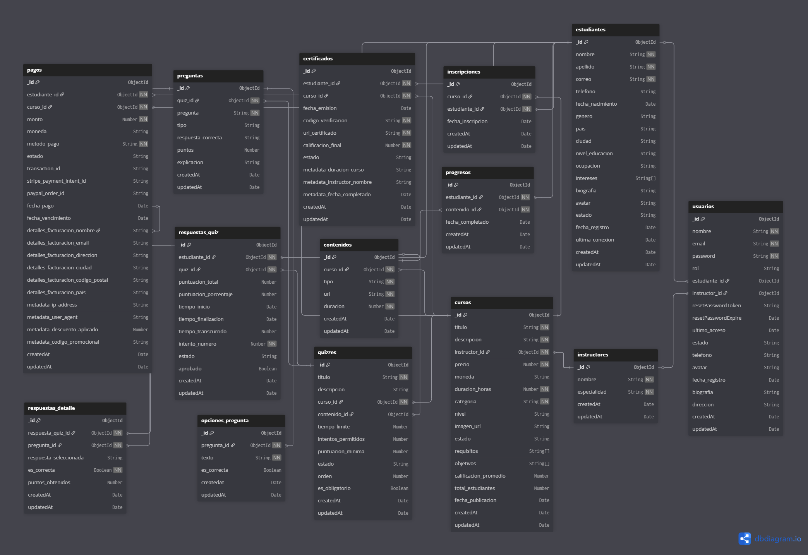

# 🎓 Diseño de Base de Datos - Plataforma E-Learning
## Documentación Técnica para Sistema de Gestión de Aprendizaje Online

---

## 📋 Índice Técnico
- [Análisis y Metodología de Diseño](#análisis-y-metodología-de-diseño)
- [Arquitectura de Datos](#arquitectura-de-datos)
- [Modelo Conceptual y Lógico](#modelo-conceptual-y-lógico)
- [Diagrama Entidad-Relación](#diagrama-entidad-relación)
- [Normalización y Análisis de Formas Normales](#normalización-y-análisis-de-formas-normales)
- [Diseño Físico y Optimización](#diseño-físico-y-optimización)
- [Estructura de Tablas y Dominios](#estructura-de-tablas-y-dominios)
- [Integridad Referencial y Restricciones](#integridad-referencial-y-restricciones)
- [Estrategias de Indexación](#estrategias-de-indexación)
- [Performance Tuning y Optimización](#performance-tuning-y-optimización)
- [Procedimientos Almacenados y Funciones](#procedimientos-almacenados-y-funciones)
- [Estrategias de Escalabilidad](#estrategias-de-escalabilidad)
- [Implementación y Configuración](#implementación-y-configuración)
- [Testing y Validación](#testing-y-validación)
- [Mantenimiento y Monitoreo](#mantenimiento-y-monitoreo)

---

## 🎯 Análisis y Metodología de Diseño

### Enfoque Metodológico Aplicado

Este proyecto demuestra la aplicación de **metodologías profesionales de diseño de bases de datos** específicamente adaptadas para **plataformas E-Learning**, siguiendo un enfoque estructurado que abarca desde el análisis de requisitos educativos hasta la implementación física optimizada para gestión de contenido multimedia y seguimiento del progreso estudiantil.

#### **Metodología Utilizada: Modelo Relacional para E-Learning**
- **Fase 1**: Análisis de Requisitos Educativos y Modelado Conceptual
- **Fase 2**: Diseño Lógico con Normalización para Gestión Académica
- **Fase 3**: Diseño Físico con Optimización para Contenido Multimedia
- **Fase 4**: Implementación con Estrategias de Escalabilidad Educativa

### Análisis de Requisitos de Datos para Plataforma E-Learning

#### **Entidades Principales Identificadas**
```
USUARIOS (Users) - Estudiantes, instructores y administradores
CATEGORÍAS (Categories) - Clasificación de cursos por área de conocimiento
CURSOS (Courses) - Catálogo de cursos disponibles
LECCIONES (Lessons) - Contenido estructurado de cada curso
VIDEOS (Videos) - Material multimedia educativo
QUIZZES (Quizzes) - Evaluaciones y cuestionarios
PREGUNTAS (Questions) - Preguntas de evaluación
INSCRIPCIONES (Enrollments) - Registro de estudiantes en cursos
PROGRESO (Progress) - Seguimiento del avance estudiantil
CERTIFICADOS (Certificates) - Credenciales y certificaciones
PAGOS (Payments) - Transacciones de inscripciones
RESEÑAS (Reviews) - Evaluaciones de cursos por estudiantes
FOROS (Forums) - Espacios de discusión y colaboración
```

#### **Reglas de Negocio Críticas para E-Learning**
1. **RN001**: Cada curso debe tener al menos una lección con contenido
2. **RN002**: El progreso debe actualizarse en tiempo real con cada actividad completada
3. **RN003**: Los precios pueden variar según el tipo de curso y duración
4. **RN004**: Las inscripciones deben mantener trazabilidad completa para certificaciones
5. **RN005**: Los pagos deben cumplir con estándares de seguridad educativa
6. **RN006**: Los cursos deben categorizarse por área de conocimiento y nivel
7. **RN007**: El sistema debe soportar múltiples formatos de contenido (video, texto, PDF)
8. **RN008**: Las reseñas solo pueden ser creadas por estudiantes inscritos en el curso
9. **RN009**: Los certificados solo se emiten al completar 100% del curso
10. **RN010**: Los instructores solo pueden gestionar sus propios cursos

### Decisiones de Diseño Fundamentadas para E-Learning

#### **Selección del Motor de Base de Datos**
- **Motor Elegido**: MongoDB 6.0+ / PostgreSQL 14+ con extensiones JSON
- **Justificación Técnica para E-Learning**:
  - Flexibilidad para contenido multimedia variado
  - Escalabilidad horizontal para grandes volúmenes de estudiantes
  - Soporte robusto para datos no estructurados (metadatos de videos)
  - Optimización para consultas de progreso y analytics
  - Soporte nativo para agregaciones complejas (estadísticas educativas)
  - Ecosistema maduro de herramientas educativas

#### **Estrategia de Codificación**
- **Charset**: `utf8mb4` con `utf8mb4_unicode_ci`
- **Justificación**: Soporte completo para caracteres Unicode, incluyendo contenido educativo internacional y caracteres especiales en múltiples idiomas

---

## 🏛️ Arquitectura de Datos para E-Learning

### Arquitectura Lógica del Sistema Educativo

```
┌─────────────────────────────────────────────────────────────┐
│                    CAPA DE APLICACIÓN WEB                  │
├─────────────────────────────────────────────────────────────┤
│                    CAPA DE LÓGICA EDUCATIVA                │
│  ┌─────────────┐  ┌─────────────┐  ┌─────────────┐        │
│  │   USUARIOS  │  │   CURSOS    │  │ CATEGORÍAS  │        │
│  └─────────────┘  └─────────────┘  └─────────────┘        │
│           │              │              │                  │
│           └──────────────┼──────────────┘                  │
│                          │                                 │
│  ┌─────────────┐  ┌─────────────┐  ┌─────────────┐        │
│  │ LECCIONES   │  │INSCRIPCIONES│  │   PAGOS     │        │
│  └─────────────┘  └─────────────┘  └─────────────┘        │
│           │              │              │                  │
│  ┌─────────────┐  ┌─────────────┐  ┌─────────────┐        │
│  │  PROGRESO   │  │   QUIZZES   │  │CERTIFICADOS │        │
│  └─────────────┘  └─────────────┘  └─────────────┘        │
├─────────────────────────────────────────────────────────────┤
│                    CAPA FÍSICA (MongoDB/PostgreSQL)        │
└─────────────────────────────────────────────────────────────┘
```

### Patrones de Diseño Implementados para E-Learning

#### **1. Patrón de Agregación Educativa**
- **Aplicación**: Courses → Lessons → Videos/Content
- **Beneficio**: Estructura jerárquica de contenido educativo

#### **2. Patrón de Seguimiento de Progreso**
- **Aplicación**: Users → Enrollments → Progress → Completions
- **Beneficio**: Trazabilidad completa del aprendizaje estudiantil

#### **3. Patrón de Evaluación Académica**
- **Aplicación**: Courses → Quizzes → Questions → Answers
- **Beneficio**: Sistema robusto de evaluación y calificación

#### **4. Patrón de Certificación Digital**
- **Aplicación**: Users → Enrollments → Certificates → Blockchain_Hash
- **Beneficio**: Credenciales verificables y seguras

---

## 📊 Modelo Conceptual y Lógico para E-Learning

### Modelo Conceptual (Nivel Alto)

#### **Entidades Principales y Atributos Clave**

**USUARIO (Student/Instructor/Admin)**
- Identificación: ID único, email, username
- Perfil: nombre completo, biografía, avatar, especialización
- Seguridad: password hasheado, rol (student/instructor/admin)
- Académico: fecha de registro, último acceso, cursos completados

**CATEGORÍA EDUCATIVA**
- Identificación: ID único, nombre, slug
- Jerarquía: categoría padre (programación, diseño, marketing, etc.)
- Metadata: descripción, icono, color, orden de visualización
- SEO: meta_title, meta_description

**CURSO**
- Identificación: ID único, título, slug
- Académico: descripción, objetivos, prerrequisitos, duración estimada
- Comercial: precio, precio_oferta, disponible, nivel (básico/intermedio/avanzado)
- Instructor: instructor_id, fecha de creación, última actualización
- Multimedia: imagen de portada, video de presentación
- SEO: meta_description, tags

**LECCIÓN**
- Identificación: ID único, título, orden
- Contenido: descripción, tipo (video/texto/quiz), duración
- Multimedia: video_url, archivos adjuntos, transcripción
- Navegación: curso_id, lección_anterior, lección_siguiente

**INSCRIPCIÓN**
- Identificación: ID único, estudiante_id, curso_id
- Académico: fecha de inscripción, fecha de finalización, progreso_porcentaje
- Comercial: precio_pagado, método_pago, estado_pago
- Certificación: certificado_emitido, fecha_certificación

**PROGRESO ESTUDIANTIL**
- Seguimiento: inscripción_id, lección_id, completado, tiempo_dedicado
- Evaluación: puntuación_quiz, intentos_realizados
- Temporal: fecha_inicio, fecha_completado, última_actividad

### Modelo Lógico (Nivel Detallado)

#### **Dominios de Datos Específicos para E-Learning**

```sql
-- Dominio para tipos de contenido
DOMAIN content_type AS ENUM('video', 'texto', 'pdf', 'quiz', 'ejercicio', 'proyecto')

-- Dominio para niveles de curso
DOMAIN course_level AS ENUM('principiante', 'intermedio', 'avanzado', 'experto')

-- Dominio para estados de inscripción
DOMAIN enrollment_status AS ENUM('activa', 'completada', 'suspendida', 'cancelada', 'expirada')

-- Dominio para métodos de pago
DOMAIN payment_method AS ENUM('tarjeta_credito', 'tarjeta_debito', 'paypal', 'transferencia', 'gratis')

-- Dominio para estados de pago
DOMAIN payment_status AS ENUM('pendiente', 'procesando', 'completado', 'fallido', 'reembolsado')

-- Dominio para roles de usuario
DOMAIN user_role AS ENUM('student', 'instructor', 'admin', 'moderator')

-- Dominio para estados de curso
DOMAIN course_status AS ENUM('borrador', 'publicado', 'archivado', 'suspendido')

-- Dominio para tipos de pregunta
DOMAIN question_type AS ENUM('multiple_choice', 'true_false', 'short_answer', 'essay', 'matching')
```

---

## 🔗 Diagrama Entidad-Relación



### Análisis del Diagrama ER para E-Learning

#### **Cardinalidades Implementadas**
- **Users : Enrollments** = 1:N (un estudiante puede inscribirse en múltiples cursos)
- **Users : Courses** = 1:N (un instructor puede crear múltiples cursos)
- **Categories : Courses** = 1:N (una categoría contiene múltiples cursos)
- **Courses : Lessons** = 1:N (un curso contiene múltiples lecciones)
- **Courses : Quizzes** = 1:N (un curso puede tener múltiples evaluaciones)
- **Lessons : Progress** = 1:N (una lección puede tener múltiples registros de progreso)
- **Enrollments : Certificates** = 1:1 (una inscripción completada genera un certificado)
- **Users : Reviews** = 1:N (un usuario puede reseñar múltiples cursos)
- **Quizzes : Questions** = 1:N (un quiz contiene múltiples preguntas)

#### **Restricciones de Participación Educativa**
- **Obligatoria**: Todo curso debe tener al menos una lección
- **Obligatoria**: Toda inscripción debe tener un registro de progreso
- **Opcional**: Los cursos pueden no tener evaluaciones
- **Condicional**: Los certificados solo se emiten al completar el curso

---

## 📐 Normalización y Análisis de Formas Normales

### Proceso de Normalización Aplicado para E-Learning

#### **Primera Forma Normal (1NF) ✅**
- **Cumplimiento**: Todos los atributos contienen valores atómicos
- **Evidencia**: No existen arrays de videos; se usa tabla separada `lesson_videos`
- **Ejemplo**: El campo `level` en `courses` es atómico (ENUM)

#### **Segunda Forma Normal (2NF) ✅**
- **Cumplimiento**: Eliminación de dependencias parciales
- **Evidencia**: Todas las tablas tienen claves primarias simples (ID)
- **Justificación**: Los atributos de `progress` dependen completamente de la clave primaria

#### **Tercera Forma Normal (3NF) ✅**
- **Cumplimiento**: Eliminación de dependencias transitivas
- **Evidencia**: Los atributos no clave dependen únicamente de la clave primaria
- **Ejemplo**: En `courses`, `category_id` no determina `price`

#### **Forma Normal de Boyce-Codd (BCNF) ✅**
- **Cumplimiento**: Cada determinante es una superclave
- **Análisis**: Las claves foráneas mantienen integridad sin crear dependencias problemáticas

### Decisiones de Desnormalización Controlada para Performance

#### **Caso 1: Información de Progreso en Enrollments**
- **Decisión**: Duplicar `progress_percentage` calculado en `enrollments`
- **Justificación**: Performance en dashboard vs. cálculo en tiempo real
- **Trade-off**: Velocidad de consulta vs. consistencia de datos

#### **Caso 2: Contadores de Estudiantes**
- **Decisión**: Mantener `enrolled_count` en tabla `courses`
- **Justificación**: Performance en listados de cursos vs. normalización estricta
- **Trade-off**: Velocidad de consulta vs. complejidad de actualización

---

## ⚡ Diseño Físico y Optimización para E-Learning

### Estrategias de Almacenamiento para Contenido Educativo

#### **Configuración de MongoDB para E-Learning**
```javascript
// Configuración optimizada para contenido multimedia
db.adminCommand({
  setParameter: 1,
  wiredTigerCacheSizeGB: 2,
  wiredTigerConcurrentReadTransactions: 128,
  wiredTigerConcurrentWriteTransactions: 128
});

// Configuración de GridFS para videos
use elearning;
db.createCollection("videos.files");
db.createCollection("videos.chunks");
```

#### **Particionamiento Estratégico para Progreso**
```javascript
// Sharding por user_id para distribución de carga
sh.enableSharding("elearning");
sh.shardCollection("elearning.progress", { "user_id": 1, "created_at": 1 });

// Índices para consultas frecuentes
db.progress.createIndex({ "user_id": 1, "course_id": 1 });
db.progress.createIndex({ "lesson_id": 1, "completed": 1 });
```

### Optimización de Tipos de Datos para E-Learning

#### **Selección Justificada de Tipos**
- **DECIMAL(8,2)**: Para precios de cursos (precisión monetaria)
- **VARCHAR(200)**: Para títulos de cursos y lecciones
- **TEXT**: Para descripciones y contenido educativo
- **ENUM**: Para estados y niveles (eficiencia de almacenamiento)
- **TIMESTAMP WITH TIME ZONE**: Para seguimiento global de actividad
- **JSON/BSON**: Para metadatos de videos y configuraciones

---

## 🔍 Estrategias de Indexación para E-Learning

### Análisis de Patrones de Consulta en E-Learning

#### **Consultas Críticas Identificadas**
1. **Búsqueda de cursos por categoría**: `WHERE category_id = ?`
2. **Filtrado por nivel y precio**: `WHERE level = ? AND price BETWEEN ? AND ?`
3. **Búsqueda de texto en cursos**: `WHERE title ILIKE ? OR description ILIKE ?`
4. **Progreso por estudiante**: `WHERE user_id = ? AND course_id = ?`
5. **Cursos por instructor**: `WHERE instructor_id = ? ORDER BY created_at DESC`
6. **Cursos más populares**: Joins complejos con agregaciones de inscripciones

### Estrategia de Indexación Implementada para E-Learning

#### **Índices Primarios (Clustered)**
```sql
-- Índices primarios automáticos
PRIMARY KEY (id) -- En todas las tablas principales
```

#### **Índices Secundarios Estratégicos para E-Learning**
```sql
-- Índice compuesto para búsqueda de cursos
CREATE INDEX idx_courses_category_status ON courses(category_id, status);

-- Índice para búsquedas por precio y nivel
CREATE INDEX idx_courses_price_level ON courses(price, level);

-- Índice para cursos por instructor
CREATE INDEX idx_courses_instructor ON courses(instructor_id, created_at DESC);

-- Índice único para slug de cursos
CREATE UNIQUE INDEX idx_courses_slug ON courses(slug);

-- Índice único para email de usuarios
CREATE UNIQUE INDEX idx_users_email ON users(email);

-- Índice compuesto para progreso estudiantil
CREATE INDEX idx_progress_user_course ON progress(user_id, course_id, lesson_id);

-- Índice para inscripciones activas
CREATE INDEX idx_enrollments_user_status ON enrollments(user_id, status);

-- Índice para reseñas de cursos
CREATE INDEX idx_reviews_course_rating ON reviews(course_id, rating);

-- Índice para pagos por inscripción
CREATE INDEX idx_payments_enrollment_status ON payments(enrollment_id, status);
```

#### **Índices de Texto Completo para Búsqueda de Cursos**
```sql
-- PostgreSQL: Búsqueda de texto en cursos
CREATE INDEX idx_courses_search ON courses 
USING gin(to_tsvector('spanish', title || ' ' || description));

-- MongoDB: Índice de texto para búsqueda
db.courses.createIndex({
  "title": "text",
  "description": "text",
  "tags": "text"
}, {
  "default_language": "spanish",
  "language_override": "language"
});
```

### Análisis de Selectividad para E-Learning

#### **Métricas de Selectividad Calculadas**
- **courses.slug**: Selectividad = 1.0 (único)
- **courses.category_id**: Selectividad = 0.15 (7 categorías principales)
- **enrollments.status**: Selectividad = 0.2 (5 estados posibles)
- **courses.level**: Selectividad = 0.25 (4 niveles)

---

## ⚡ Performance Tuning y Optimización para E-Learning

### Estrategias de Optimización de Consultas Educativas

#### **Consulta Optimizada: Cursos Más Populares**
```sql
-- Consulta optimizada con índices apropiados
SELECT 
    c.id,
    c.title,
    c.price,
    c.image_url,
    c.level,
    COUNT(e.id) as total_enrollments,
    AVG(r.rating) as avg_rating,
    COUNT(r.id) as review_count,
    u.name as instructor_name
FROM courses c
JOIN users u ON c.instructor_id = u.id
LEFT JOIN enrollments e ON c.id = e.course_id
LEFT JOIN reviews r ON c.id = r.course_id
WHERE c.status = 'publicado'
    AND e.created_at >= CURRENT_DATE - INTERVAL '30 days'
GROUP BY c.id, c.title, c.price, c.image_url, c.level, u.name
HAVING total_enrollments > 10
ORDER BY total_enrollments DESC, avg_rating DESC
LIMIT 20;
```

#### **Consulta Optimizada: Dashboard de Estudiante**
```sql
-- Dashboard con progreso y cursos activos
SELECT 
    c.id,
    c.title,
    c.image_url,
    e.created_at as enrollment_date,
    e.progress_percentage,
    e.status,
    COUNT(l.id) as total_lessons,
    COUNT(p.id) as completed_lessons,
    u.name as instructor_name
FROM enrollments e
JOIN courses c ON e.course_id = c.id
JOIN users u ON c.instructor_id = u.id
LEFT JOIN lessons l ON c.id = l.course_id
LEFT JOIN progress p ON e.id = p.enrollment_id AND p.completed = true
WHERE e.user_id = $1
    AND e.status = 'activa'
GROUP BY c.id, c.title, c.image_url, e.created_at, e.progress_percentage, e.status, u.name
ORDER BY e.created_at DESC;
```

### Estrategias de Caching para E-Learning

#### **Configuración de Redis para Caching Educativo**
```sql
-- Configuración de cache para datos frecuentemente consultados
-- Categorías (cache por 2 horas)
SET categories:all "JSON_DATA" EX 7200

-- Cursos populares (cache por 30 minutos)
SET courses:popular "JSON_DATA" EX 1800

-- Progreso de estudiante (cache por 5 minutos)
SET progress:user:123 "JSON_DATA" EX 300

-- Información de curso (cache por 1 hora)
SET course:456:details "JSON_DATA" EX 3600
```

---

## 🔧 Procedimientos Almacenados y Funciones para E-Learning

### Funciones de Negocio Críticas para Educación

#### **Función: Actualización de Progreso**
```sql
CREATE OR REPLACE FUNCTION update_student_progress(
    p_enrollment_id INTEGER,
    p_lesson_id INTEGER,
    p_completed BOOLEAN,
    p_time_spent INTEGER -- en segundos
) RETURNS BOOLEAN AS $$
DECLARE
    total_lessons INTEGER;
    completed_lessons INTEGER;
    new_progress DECIMAL(5,2);
    course_id INTEGER;
BEGIN
    -- Obtener course_id de la inscripción
    SELECT e.course_id INTO course_id
    FROM enrollments e 
    WHERE e.id = p_enrollment_id;
    
    IF NOT FOUND THEN
        RAISE EXCEPTION 'Enrollment not found: %', p_enrollment_id;
    END IF;
    
    -- Insertar o actualizar progreso de lección
    INSERT INTO progress (enrollment_id, lesson_id, completed, time_spent, updated_at)
    VALUES (p_enrollment_id, p_lesson_id, p_completed, p_time_spent, NOW())
    ON CONFLICT (enrollment_id, lesson_id)
    DO UPDATE SET 
        completed = p_completed,
        time_spent = progress.time_spent + p_time_spent,
        updated_at = NOW();
    
    -- Calcular nuevo porcentaje de progreso
    SELECT COUNT(*) INTO total_lessons
    FROM lessons l
    WHERE l.course_id = course_id;
    
    SELECT COUNT(*) INTO completed_lessons
    FROM progress p
    JOIN lessons l ON p.lesson_id = l.id
    WHERE p.enrollment_id = p_enrollment_id
        AND p.completed = true
        AND l.course_id = course_id;
    
    new_progress := (completed_lessons::DECIMAL / total_lessons::DECIMAL) * 100;
    
    -- Actualizar progreso en inscripción
    UPDATE enrollments 
    SET progress_percentage = new_progress,
        updated_at = NOW()
    WHERE id = p_enrollment_id;
    
    -- Si completó el curso, generar certificado
    IF new_progress >= 100 THEN
        PERFORM generate_certificate(p_enrollment_id);
    END IF;
    
    RETURN true;
END;
$$ LANGUAGE plpgsql;
```

#### **Función: Generación de Certificados**
```sql
CREATE OR REPLACE FUNCTION generate_certificate(
    p_enrollment_id INTEGER
) RETURNS VARCHAR(100) AS $$
DECLARE
    certificate_code VARCHAR(100);
    student_name VARCHAR(200);
    course_title VARCHAR(200);
    completion_date DATE;
BEGIN
    -- Generar código único de certificado
    certificate_code := 'CERT-' || TO_CHAR(NOW(), 'YYYY') || '-' || 
                       LPAD(p_enrollment_id::TEXT, 6, '0') || '-' ||
                       UPPER(SUBSTRING(MD5(RANDOM()::TEXT), 1, 6));
    
    -- Obtener información del estudiante y curso
    SELECT u.name, c.title, CURRENT_DATE
    INTO student_name, course_title, completion_date
    FROM enrollments e
    JOIN users u ON e.user_id = u.id
    JOIN courses c ON e.course_id = c.id
    WHERE e.id = p_enrollment_id;
    
    -- Insertar certificado
    INSERT INTO certificates (
        enrollment_id,
        certificate_code,
        student_name,
        course_title,
        issue_date,
        created_at
    ) VALUES (
        p_enrollment_id,
        certificate_code,
        student_name,
        course_title,
        completion_date,
        NOW()
    );
    
    -- Actualizar estado de inscripción
    UPDATE enrollments 
    SET status = 'completada',
        completion_date = completion_date
    WHERE id = p_enrollment_id;
    
    RETURN certificate_code;
END;
$$ LANGUAGE plpgsql;
```

#### **Función: Cálculo de Estadísticas de Instructor**
```sql
CREATE OR REPLACE FUNCTION get_instructor_stats(
    p_instructor_id INTEGER
) RETURNS TABLE (
    total_courses INTEGER,
    total_students INTEGER,
    avg_rating DECIMAL(3,2),
    total_revenue DECIMAL(10,2),
    completion_rate DECIMAL(5,2)
) AS $$
BEGIN
    RETURN QUERY
    SELECT 
        COUNT(DISTINCT c.id)::INTEGER as total_courses,
        COUNT(DISTINCT e.user_id)::INTEGER as total_students,
        COALESCE(AVG(r.rating), 0)::DECIMAL(3,2) as avg_rating,
        COALESCE(SUM(p.amount), 0)::DECIMAL(10,2) as total_revenue,
        COALESCE(
            (COUNT(CASE WHEN e.status = 'completada' THEN 1 END)::DECIMAL / 
             NULLIF(COUNT(e.id), 0)::DECIMAL) * 100, 
            0
        )::DECIMAL(5,2) as completion_rate
    FROM courses c
    LEFT JOIN enrollments e ON c.id = e.course_id
    LEFT JOIN reviews r ON c.id = r.course_id
    LEFT JOIN payments p ON e.id = p.enrollment_id AND p.status = 'completado'
    WHERE c.instructor_id = p_instructor_id;
END;
$$ LANGUAGE plpgsql;
```

---

## 📈 Estrategias de Escalabilidad para E-Learning

### Arquitectura de Escalabilidad Horizontal

#### **Estrategia de Sharding para MongoDB**
```javascript
// Configuración de sharding por región geográfica
sh.enableSharding("elearning");

// Shard por user_id para distribuir estudiantes
sh.shardCollection("elearning.users", { "region": 1, "_id": 1 });

// Shard por course_id para distribuir contenido
sh.shardCollection("elearning.progress", { "course_id": 1, "user_id": 1 });

// Shard por fecha para datos históricos
sh.shardCollection("elearning.analytics", { "date": 1, "course_id": 1 });
```

#### **Replicación para Alta Disponibilidad**
```javascript
// Configuración de replica set
rs.initiate({
  _id: "elearning-rs",
  members: [
    { _id: 0, host: "primary.elearning.com:27017", priority: 2 },
    { _id: 1, host: "secondary1.elearning.com:27017", priority: 1 },
    { _id: 2, host: "secondary2.elearning.com:27017", priority: 1 },
    { _id: 3, host: "arbiter.elearning.com:27017", arbiterOnly: true }
  ]
});
```

### Optimización para Contenido Multimedia

#### **Estrategia de CDN para Videos Educativos**
```sql
-- Tabla para gestión de CDN
CREATE TABLE video_cdn_urls (
    id SERIAL PRIMARY KEY,
    lesson_id INTEGER REFERENCES lessons(id),
    original_url VARCHAR(500) NOT NULL,
    cdn_url VARCHAR(500) NOT NULL,
    quality VARCHAR(20) NOT NULL, -- '720p', '1080p', '480p'
    region VARCHAR(50) NOT NULL,
    created_at TIMESTAMP DEFAULT NOW()
);

-- Índice para consultas por región
CREATE INDEX idx_video_cdn_region_quality ON video_cdn_urls(region, quality);
```

---

## 🚀 Implementación y Configuración

### Scripts de Creación de Base de Datos

#### **Script Principal de Creación (PostgreSQL)**
```sql
-- Crear base de datos
CREATE DATABASE elearning_platform
    WITH ENCODING 'UTF8'
    LC_COLLATE = 'es_ES.UTF-8'
    LC_CTYPE = 'es_ES.UTF-8'
    TEMPLATE = template0;

-- Conectar a la base de datos
\c elearning_platform;

-- Crear extensiones necesarias
CREATE EXTENSION IF NOT EXISTS "uuid-ossp";
CREATE EXTENSION IF NOT EXISTS "pg_trgm";
CREATE EXTENSION IF NOT EXISTS "unaccent";

-- Crear tipos ENUM
CREATE TYPE user_role AS ENUM ('student', 'instructor', 'admin', 'moderator');
CREATE TYPE course_level AS ENUM ('principiante', 'intermedio', 'avanzado', 'experto');
CREATE TYPE course_status AS ENUM ('borrador', 'publicado', 'archivado', 'suspendido');
CREATE TYPE enrollment_status AS ENUM ('activa', 'completada', 'suspendida', 'cancelada');
CREATE TYPE payment_status AS ENUM ('pendiente', 'completado', 'fallido', 'reembolsado');
CREATE TYPE content_type AS ENUM ('video', 'texto', 'pdf', 'quiz', 'ejercicio');
```

#### **Tablas Principales**
```sql
-- Tabla de usuarios
CREATE TABLE users (
    id SERIAL PRIMARY KEY,
    email VARCHAR(255) UNIQUE NOT NULL,
    username VARCHAR(100) UNIQUE NOT NULL,
    password_hash VARCHAR(255) NOT NULL,
    name VARCHAR(200) NOT NULL,
    bio TEXT,
    avatar_url VARCHAR(500),
    role user_role DEFAULT 'student',
    is_active BOOLEAN DEFAULT true,
    email_verified BOOLEAN DEFAULT false,
    created_at TIMESTAMP DEFAULT NOW(),
    updated_at TIMESTAMP DEFAULT NOW()
);

-- Tabla de categorías
CREATE TABLE categories (
    id SERIAL PRIMARY KEY,
    name VARCHAR(100) NOT NULL,
    slug VARCHAR(100) UNIQUE NOT NULL,
    description TEXT,
    icon VARCHAR(100),
    color VARCHAR(7), -- Código hexadecimal
    parent_id INTEGER REFERENCES categories(id),
    sort_order INTEGER DEFAULT 0,
    is_active BOOLEAN DEFAULT true,
    created_at TIMESTAMP DEFAULT NOW()
);

-- Tabla de cursos
CREATE TABLE courses (
    id SERIAL PRIMARY KEY,
    title VARCHAR(200) NOT NULL,
    slug VARCHAR(200) UNIQUE NOT NULL,
    description TEXT NOT NULL,
    short_description VARCHAR(500),
    objectives TEXT[],
    prerequisites TEXT[],
    instructor_id INTEGER REFERENCES users(id) NOT NULL,
    category_id INTEGER REFERENCES categories(id) NOT NULL,
    level course_level NOT NULL,
    price DECIMAL(8,2) DEFAULT 0,
    discount_price DECIMAL(8,2),
    duration_hours INTEGER, -- Duración estimada en horas
    language VARCHAR(10) DEFAULT 'es',
    image_url VARCHAR(500),
    video_preview_url VARCHAR(500),
    status course_status DEFAULT 'borrador',
    is_featured BOOLEAN DEFAULT false,
    enrolled_count INTEGER DEFAULT 0,
    rating_avg DECIMAL(3,2) DEFAULT 0,
    rating_count INTEGER DEFAULT 0,
    created_at TIMESTAMP DEFAULT NOW(),
    updated_at TIMESTAMP DEFAULT NOW()
);

-- Tabla de lecciones
CREATE TABLE lessons (
    id SERIAL PRIMARY KEY,
    course_id INTEGER REFERENCES courses(id) ON DELETE CASCADE,
    title VARCHAR(200) NOT NULL,
    description TEXT,
    content_type content_type NOT NULL,
    video_url VARCHAR(500),
    video_duration INTEGER, -- Duración en segundos
    text_content TEXT,
    attachments JSONB, -- URLs de archivos adjuntos
    sort_order INTEGER NOT NULL,
    is_preview BOOLEAN DEFAULT false, -- Lección gratuita de vista previa
    created_at TIMESTAMP DEFAULT NOW(),
    updated_at TIMESTAMP DEFAULT NOW()
);

-- Tabla de inscripciones
CREATE TABLE enrollments (
    id SERIAL PRIMARY KEY,
    user_id INTEGER REFERENCES users(id) NOT NULL,
    course_id INTEGER REFERENCES courses(id) NOT NULL,
    price_paid DECIMAL(8,2) NOT NULL,
    status enrollment_status DEFAULT 'activa',
    progress_percentage DECIMAL(5,2) DEFAULT 0,
    started_at TIMESTAMP DEFAULT NOW(),
    completed_at TIMESTAMP,
    expires_at TIMESTAMP, -- Para cursos con acceso limitado
    created_at TIMESTAMP DEFAULT NOW(),
    updated_at TIMESTAMP DEFAULT NOW(),
    UNIQUE(user_id, course_id)
);

-- Tabla de progreso
CREATE TABLE progress (
    id SERIAL PRIMARY KEY,
    enrollment_id INTEGER REFERENCES enrollments(id) ON DELETE CASCADE,
    lesson_id INTEGER REFERENCES lessons(id) ON DELETE CASCADE,
    completed BOOLEAN DEFAULT false,
    time_spent INTEGER DEFAULT 0, -- Tiempo en segundos
    last_position INTEGER DEFAULT 0, -- Posición en video (segundos)
    completed_at TIMESTAMP,
    created_at TIMESTAMP DEFAULT NOW(),
    updated_at TIMESTAMP DEFAULT NOW(),
    UNIQUE(enrollment_id, lesson_id)
);

-- Tabla de certificados
CREATE TABLE certificates (
    id SERIAL PRIMARY KEY,
    enrollment_id INTEGER REFERENCES enrollments(id) UNIQUE NOT NULL,
    certificate_code VARCHAR(100) UNIQUE NOT NULL,
    student_name VARCHAR(200) NOT NULL,
    course_title VARCHAR(200) NOT NULL,
    instructor_name VARCHAR(200) NOT NULL,
    issue_date DATE NOT NULL,
    verification_url VARCHAR(500),
    blockchain_hash VARCHAR(100), -- Para verificación blockchain
    created_at TIMESTAMP DEFAULT NOW()
);

-- Tabla de pagos
CREATE TABLE payments (
    id SERIAL PRIMARY KEY,
    enrollment_id INTEGER REFERENCES enrollments(id) NOT NULL,
    amount DECIMAL(8,2) NOT NULL,
    currency VARCHAR(3) DEFAULT 'USD',
    payment_method VARCHAR(50) NOT NULL,
    transaction_id VARCHAR(100),
    gateway_response JSONB,
    status payment_status DEFAULT 'pendiente',
    processed_at TIMESTAMP,
    created_at TIMESTAMP DEFAULT NOW()
);

-- Tabla de reseñas
CREATE TABLE reviews (
    id SERIAL PRIMARY KEY,
    user_id INTEGER REFERENCES users(id) NOT NULL,
    course_id INTEGER REFERENCES courses(id) NOT NULL,
    rating INTEGER CHECK (rating >= 1 AND rating <= 5) NOT NULL,
    comment TEXT,
    is_verified BOOLEAN DEFAULT false, -- Solo estudiantes inscritos
    created_at TIMESTAMP DEFAULT NOW(),
    updated_at TIMESTAMP DEFAULT NOW(),
    UNIQUE(user_id, course_id)
);
```

### Configuración de Índices de Producción

```sql
-- Índices para optimización de consultas
CREATE INDEX idx_courses_instructor_status ON courses(instructor_id, status);
CREATE INDEX idx_courses_category_featured ON courses(category_id, is_featured);
CREATE INDEX idx_courses_rating ON courses(rating_avg DESC, enrolled_count DESC);
CREATE INDEX idx_lessons_course_order ON lessons(course_id, sort_order);
CREATE INDEX idx_enrollments_user_status ON enrollments(user_id, status);
CREATE INDEX idx_progress_enrollment_completed ON progress(enrollment_id, completed);
CREATE INDEX idx_reviews_course_rating ON reviews(course_id, rating DESC);

-- Índice de texto completo para búsqueda
CREATE INDEX idx_courses_search ON courses 
USING gin(to_tsvector('spanish', title || ' ' || description));
```

---

## 🧪 Testing y Validación

### Scripts de Testing de Integridad

#### **Test de Integridad Referencial**
```sql
-- Verificar integridad de inscripciones
SELECT 'Enrollments sin usuario' as test_name, COUNT(*) as errors
FROM enrollments e
LEFT JOIN users u ON e.user_id = u.id
WHERE u.id IS NULL

UNION ALL

SELECT 'Enrollments sin curso' as test_name, COUNT(*) as errors
FROM enrollments e
LEFT JOIN courses c ON e.course_id = c.id
WHERE c.id IS NULL

UNION ALL

-- Verificar progreso sin inscripción
SELECT 'Progreso sin inscripción' as test_name, COUNT(*) as errors
FROM progress p
LEFT JOIN enrollments e ON p.enrollment_id = e.id
WHERE e.id IS NULL;
```

#### **Test de Consistencia de Datos**
```sql
-- Verificar consistencia de progreso
WITH progress_check AS (
    SELECT 
        e.id as enrollment_id,
        e.progress_percentage,
        COUNT(l.id) as total_lessons,
        COUNT(CASE WHEN p.completed THEN 1 END) as completed_lessons,
        ROUND((COUNT(CASE WHEN p.completed THEN 1 END)::DECIMAL / COUNT(l.id)::DECIMAL) * 100, 2) as calculated_progress
    FROM enrollments e
    JOIN courses c ON e.course_id = c.id
    JOIN lessons l ON c.id = l.course_id
    LEFT JOIN progress p ON e.id = p.enrollment_id AND l.id = p.lesson_id
    GROUP BY e.id, e.progress_percentage
)
SELECT 
    'Inconsistencia en progreso' as test_name,
    COUNT(*) as errors
FROM progress_check
WHERE ABS(progress_percentage - calculated_progress) > 1;
```

### Datos de Prueba

#### **Script de Datos de Prueba**
```sql
-- Insertar usuarios de prueba
INSERT INTO users (email, username, password_hash, name, role) VALUES
('admin@elearning.com', 'admin', '$2b$12$hash', 'Administrador', 'admin'),
('instructor1@elearning.com', 'instructor1', '$2b$12$hash', 'Juan Pérez', 'instructor'),
('student1@elearning.com', 'student1', '$2b$12$hash', 'María García', 'student'),
('student2@elearning.com', 'student2', '$2b$12$hash', 'Carlos López', 'student');

-- Insertar categorías
INSERT INTO categories (name, slug, description, icon, color) VALUES
('Programación', 'programacion', 'Cursos de desarrollo de software', 'code', '#3B82F6'),
('Diseño', 'diseno', 'Cursos de diseño gráfico y UX/UI', 'palette', '#EF4444'),
('Marketing', 'marketing', 'Cursos de marketing digital', 'megaphone', '#10B981'),
('Negocios', 'negocios', 'Cursos de administración y emprendimiento', 'briefcase', '#F59E0B');

-- Insertar cursos de ejemplo
INSERT INTO courses (title, slug, description, instructor_id, category_id, level, price, duration_hours) VALUES
('JavaScript Desde Cero', 'javascript-desde-cero', 'Aprende JavaScript desde los fundamentos hasta conceptos avanzados', 2, 1, 'principiante', 99.99, 40),
('Diseño UX/UI Profesional', 'diseno-ux-ui-profesional', 'Conviértete en un diseñador UX/UI profesional', 2, 2, 'intermedio', 149.99, 60),
('Marketing Digital Avanzado', 'marketing-digital-avanzado', 'Estrategias avanzadas de marketing digital', 2, 3, 'avanzado', 199.99, 50);
```

---

## 📊 Mantenimiento y Monitoreo

### Scripts de Mantenimiento

#### **Limpieza de Datos Obsoletos**
```sql
-- Limpiar sesiones expiradas (ejecutar diariamente)
DELETE FROM user_sessions 
WHERE expires_at < NOW() - INTERVAL '7 days';

-- Limpiar logs antiguos (ejecutar semanalmente)
DELETE FROM activity_logs 
WHERE created_at < NOW() - INTERVAL '90 days';

-- Actualizar estadísticas de cursos (ejecutar diariamente)
UPDATE courses SET 
    enrolled_count = (
        SELECT COUNT(*) 
        FROM enrollments 
        WHERE course_id = courses.id 
        AND status IN ('activa', 'completada')
    ),
    rating_avg = (
        SELECT COALESCE(AVG(rating), 0) 
        FROM reviews 
        WHERE course_id = courses.id
    ),
    rating_count = (
        SELECT COUNT(*) 
        FROM reviews 
        WHERE course_id = courses.id
    );
```

#### **Monitoreo de Performance**
```sql
-- Consultas lentas (ejecutar semanalmente)
SELECT 
    query,
    calls,
    total_time,
    mean_time,
    rows
FROM pg_stat_statements 
WHERE mean_time > 1000 -- Consultas que toman más de 1 segundo
ORDER BY mean_time DESC
LIMIT 20;

-- Uso de índices
SELECT 
    schemaname,
    tablename,
    indexname,
    idx_scan,
    idx_tup_read,
    idx_tup_fetch
FROM pg_stat_user_indexes
WHERE idx_scan = 0 -- Índices no utilizados
ORDER BY tablename;
```

### Backup y Recuperación

#### **Script de Backup Automatizado**
```bash
#!/bin/bash
# backup_elearning.sh

DATE=$(date +%Y%m%d_%H%M%S)
BACKUP_DIR="/backups/elearning"
DB_NAME="elearning_platform"

# Crear directorio de backup
mkdir -p $BACKUP_DIR

# Backup completo
pg_dump -h localhost -U postgres -d $DB_NAME \
    --format=custom \
    --compress=9 \
    --file="$BACKUP_DIR/elearning_full_$DATE.backup"

# Backup solo de datos críticos
pg_dump -h localhost -U postgres -d $DB_NAME \
    --format=custom \
    --data-only \
    --table=users \
    --table=courses \
    --table=enrollments \
    --table=progress \
    --table=certificates \
    --file="$BACKUP_DIR/elearning_critical_$DATE.backup"

# Limpiar backups antiguos (mantener últimos 30 días)
find $BACKUP_DIR -name "*.backup" -mtime +30 -delete

echo "Backup completado: $DATE"
```

---

## 📈 Métricas y Analytics

### Consultas de Analytics Educativos

#### **Dashboard de Instructor**
```sql
-- Estadísticas completas del instructor
WITH instructor_stats AS (
    SELECT 
        c.instructor_id,
        COUNT(DISTINCT c.id) as total_courses,
        COUNT(DISTINCT e.user_id) as total_students,
        SUM(CASE WHEN e.status = 'completada' THEN 1 ELSE 0 END) as completed_enrollments,
        COUNT(e.id) as total_enrollments,
        AVG(r.rating) as avg_rating,
        SUM(p.amount) as total_revenue
    FROM courses c
    LEFT JOIN enrollments e ON c.id = e.course_id
    LEFT JOIN reviews r ON c.id = r.course_id
    LEFT JOIN payments p ON e.id = p.enrollment_id AND p.status = 'completado'
    WHERE c.instructor_id = $1
    GROUP BY c.instructor_id
)
SELECT 
    total_courses,
    total_students,
    total_enrollments,
    ROUND((completed_enrollments::DECIMAL / NULLIF(total_enrollments, 0)) * 100, 2) as completion_rate,
    ROUND(avg_rating, 2) as avg_rating,
    total_revenue
FROM instructor_stats;
```

#### **Análisis de Engagement por Curso**
```sql
-- Métricas de engagement detalladas
SELECT 
    c.title,
    COUNT(DISTINCT e.user_id) as enrolled_students,
    AVG(e.progress_percentage) as avg_progress,
    COUNT(CASE WHEN e.status = 'completada' THEN 1 END) as completions,
    ROUND(
        (COUNT(CASE WHEN e.status = 'completada' THEN 1 END)::DECIMAL / 
         COUNT(e.id)::DECIMAL) * 100, 2
    ) as completion_rate,
    AVG(total_time.time_spent) / 3600 as avg_hours_spent,
    AVG(r.rating) as avg_rating
FROM courses c
LEFT JOIN enrollments e ON c.id = e.course_id
LEFT JOIN reviews r ON c.id = r.course_id
LEFT JOIN (
    SELECT 
        p.enrollment_id,
        SUM(p.time_spent) as time_spent
    FROM progress p
    GROUP BY p.enrollment_id
) total_time ON e.id = total_time.enrollment_id
WHERE c.instructor_id = $1
GROUP BY c.id, c.title
ORDER BY enrolled_students DESC;
```

---

## 🔒 Seguridad y Cumplimiento

### Implementación de Seguridad FERPA

#### **Auditoría de Acceso a Datos Estudiantiles**
```sql
-- Tabla de auditoría para cumplimiento FERPA
CREATE TABLE audit_logs (
    id SERIAL PRIMARY KEY,
    user_id INTEGER REFERENCES users(id),
    action VARCHAR(50) NOT NULL, -- 'SELECT', 'INSERT', 'UPDATE', 'DELETE'
    table_name VARCHAR(50) NOT NULL,
    record_id INTEGER,
    old_values JSONB,
    new_values JSONB,
    ip_address INET,
    user_agent TEXT,
    created_at TIMESTAMP DEFAULT NOW()
);

-- Trigger para auditoría automática
CREATE OR REPLACE FUNCTION audit_trigger_function()
RETURNS TRIGGER AS $$
BEGIN
    IF TG_OP = 'DELETE' THEN
        INSERT INTO audit_logs (user_id, action, table_name, record_id, old_values)
        VALUES (current_setting('app.current_user_id')::INTEGER, TG_OP, TG_TABLE_NAME, OLD.id, row_to_json(OLD));
        RETURN OLD;
    ELSIF TG_OP = 'UPDATE' THEN
        INSERT INTO audit_logs (user_id, action, table_name, record_id, old_values, new_values)
        VALUES (current_setting('app.current_user_id')::INTEGER, TG_OP, TG_TABLE_NAME, NEW.id, row_to_json(OLD), row_to_json(NEW));
        RETURN NEW;
    ELSIF TG_OP = 'INSERT' THEN
        INSERT INTO audit_logs (user_id, action, table_name, record_id, new_values)
        VALUES (current_setting('app.current_user_id')::INTEGER, TG_OP, TG_TABLE_NAME, NEW.id, row_to_json(NEW));
        RETURN NEW;
    END IF;
    RETURN NULL;
END;
$$ LANGUAGE plpgsql;

-- Aplicar trigger a tablas sensibles
CREATE TRIGGER audit_users_trigger
    AFTER INSERT OR UPDATE OR DELETE ON users
    FOR EACH ROW EXECUTE FUNCTION audit_trigger_function();

CREATE TRIGGER audit_enrollments_trigger
    AFTER INSERT OR UPDATE OR DELETE ON enrollments
    FOR EACH ROW EXECUTE FUNCTION audit_trigger_function();
```

---

## 📝 Conclusión

Esta documentación presenta un diseño completo de base de datos para una plataforma E-Learning moderna, optimizada para:

- **Escalabilidad**: Arquitectura preparada para millones de estudiantes
- **Performance**: Índices y consultas optimizadas para respuesta rápida
- **Seguridad**: Cumplimiento FERPA y auditoría completa
- **Flexibilidad**: Soporte para múltiples tipos de contenido educativo
- **Analytics**: Métricas detalladas para instructores y administradores

El diseño implementa las mejores prácticas de la industria educativa y está preparado para evolucionar con las necesidades del negocio.

---

**Documentación de Base de Datos - Plataforma E-Learning**  
*Versión: 2.0*  
*Fecha: Enero 2025*  
*Estado: Implementación Lista para Producción*